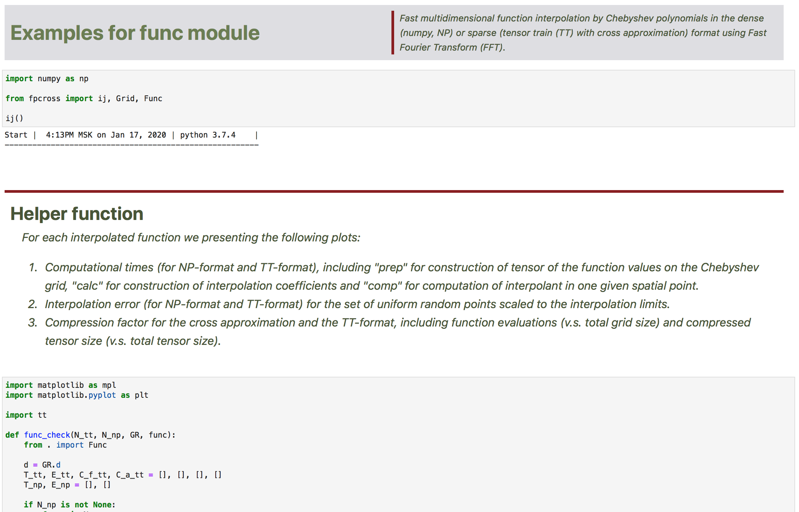
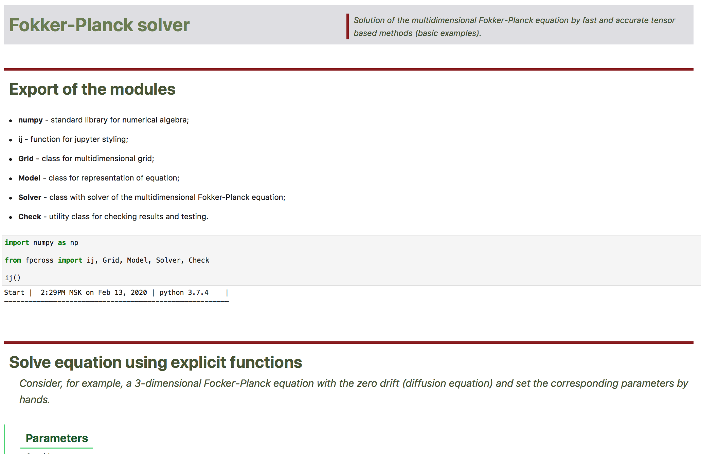

# Package fpcross

## Description

Solution of the multidimensional Fokker-Planck equation (FPE) of the form

d r(x, t) / d t = D delta( r(x, t) ) - div( f(x, t) r(x, t) ),
r(x,0) = r0(x),

with known f(x, t), initial condition r0(x) and scalar diffusion coefficient D by fast and accurate tensor based methods with cross approximation in the tensor-train (TT) format.

## Requirements

1. [Python](https://www.python.org) programming language (version >= 3.7).

1. Standard python packages like [numpy](https://numpy.org), [scipy](https://www.scipy.org), [matplotlib](https://matplotlib.org), etc. (all of them are included in [anaconda](https://www.anaconda.com/download/) distribution).

1. Python package [ttpy](https://github.com/oseledets/ttpy).

1. Browser based gui for python [jupyter lab](https://github.com/jupyterlab/jupyterlab) (is included in [anaconda](https://www.anaconda.com/download/) distribution).

## Installation

1. Install **python** (version >= 3.7) and standard python packages listed in the section **Requirements** above. The best way is to install only **anaconda** distribution which includes this packages.

1. Install **ttpy** python package according to instructions from the corresponding repository.

1. Download this repository and run `python setup.py install` from the root folder of the project.

    > To uninstall this package from the system run `pip uninstall fpcross`.

## Tests

Run `python ./tests/test.py` from the root folder of the project to perform all tests (`-v` option is available).

## Examples

All examples are performed as interactive browser-based jupyter lab notebooks. To work with any example do the following steps

1. Run from the terminal (console) `jupyter lab`.

    > The corresponding window with jupyter lab gui will be opened in the default web-browser.

1. Find and open in the directory tree (at the left side of the jupyter lab window) the `fpcross/examples` folder.

1. Open one of the jupyter lab notebooks from this folder.

    - See `./examples/func.ipynb` for interpolation submodule details;

      

    - See `./examples/fpe.ipynb` for example of solver usage;

      

    - See another jupyter lab notebooks in `./examples/` folder for examples of various special use cases.

1. Run all cells in the jupyter lab notebook one by one.

## Authors

* Andrei Chertkov

  > andrei.chertkov@skolkovotech.ru

* Ivan Oseledets

  > i.oseledets@skoltech.ru

## Related publications

...

## TODO

* [x] Convert the code to python package and add setup.py file.

* [ ] Set more accurate form for config file.

* [x] All flags (bool arguments) should have the same default value (`False`).

* [ ] Add link to our related publication.

* [x] Add basic tests for all modules.

* [ ] Add advanced tests for all modules.

* ~~Find a more suitable name for the package and rename it.~~

* [ ] Add package to pypi.

* [ ] Select convention for the doc-strings (functions and classes) and update the corresponding comments in the code.
